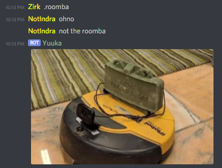

# Yuuka
A Discord bot where you create commands that display texts/images/audios

The idea is simple, you begin by creating a tag
```
.create tagName tagContent
```
And then you can use it by doing
```
.tagName
```
Who will display
```
tagContent
```

tagContent can either be text, or an image/audio file (you'ld need to send it in attachment).
<br/>
<br/>
The bot would then display the text/image or play the audio file in vocal channel

## How to use the bot
 - Go to the [release page](https://github.com/Xwilarg/Yuuka/releases) and download the latest available
 - Create a [new bot application](https://discordpy.readthedocs.io/en/latest/discord.html)
 - Start the bot
 
**NOTE:**
 - The tags you use are shared between all the servers the bot is in
 - The bot use ReThinkdb to store the tags, by default it's use its own but you can also launch yours
 - The bot will save all the tags in your computer (using the db) so please make note that creating a lot of them will therefor take some space

## Need help?
You can either:
 - Come ask on the [support server](https://discordapp.com/invite/H6wMRYV)
 - Open a [GitHub issue](https://github.com/Xwilarg/Yuuka/issues)
 - Contact Zirk#0001 on Discord

